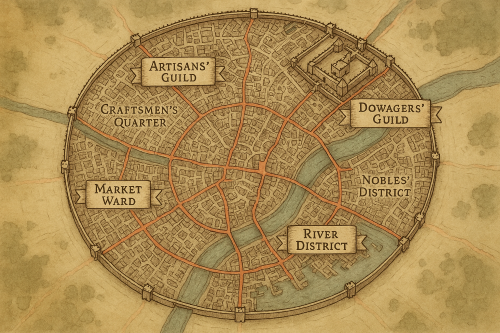

# GuildWars
*GuildWars* is a tabletop roleplaying game set in a bustling city, where each player controls a unique Guild—an organization such as a thieves' guild, mercenary company, farmers' collective, religious order, trade guild, or any group the imagination allows. Each Guild is composed of leveled 5e characters, a variety of staff, valuable resources and assets, and a custom guild house within the city.

Players develop their Guilds by recruiting members, securing resources, forging alliances, and overcoming challenges. They must navigate threats both internal and external—whether through combat, subterfuge, market maneuvers, or infiltration of rival guilds.

Ultimately, each Guild vies for dominance, seeking to gain control of the city and claim victory.

---

\page
# Game Goals
There is no Game *Master* in *GuildWars*, instead the players are all responsible for contributing to a functioning game.  To motivate and share load, a mechanic where tasks done that assist the game's progress grant that player some level of influence in the world.
## Game Tasks 
These are some common player tasks necessary to run the game:
- **Ideas:** ideas, concepts, mission ideas, Guild concepts, Story Plots character sketches, can be voted to be influence worthy.
- **Battle Maps:** especially custom maps to specification, such as Guild Headquarters, or an area of a city, that will be used for combat.
- Prepping and Running Guild vs. Non Player Encounters (Combat or Roleplay, or both)
- Running an Encounter to Adjudicate battles in Guild vs Guild Combats (or Roleplay as needed)
- **Administration:** monitoring Faction Standings, recording Player and Guild actions, maintaining a Game server
- **Other:** players can propose that tasks are worthy of reward, and the players will then vote, and then agree on the value. 

At any time a member can propose an Action that they feel is worthy of Influence. See Veto rules below to handle disagreements.

## Vetos, Voting, and Scoring
*GuildWars* is intended to be self balancing.  With *complete* freedom afforded the players, ludicrous, non story worthy activity might be added.  The veto system is an attempt to control this, giving players the chance to vote to remove or cancel such activities.  This mechanic gives players collective majority control to alter campaign direction.  Its worth noting here that veto power can override these rules, should the players so decide.

### The Veto Mechanic 
At any time, during any period of the game, a player holding a ***Veto Token*** may spend that token to call veto on a statement made by a player.
This triggers a vote of all players, to decide whether that statement is allowed to continue.  
- Votes must be completed before any further play continues, and no further veto may be called until the vote is completed.
- The Vote is either an open or closed ballot, chosen by the vetoing player.
- Players may abstain from voting.
- Tiebreaks are broken by the player calling the vote.

#### On a successful (majority) vote
- The vetoing player regains their **Veto Token**.
- The player who made the original statement must restate it until it is accepted by the vetoing player, or opt to withdraw their action entirely.  If they choose to withdraw, the new action must be different.
- The Successful veto doesn't allow the vetoing player to make any statements of their own.
#### On a failed vote
- The statement is valid, and passes as it was originally stated.
- The vetoing player loses their token.

In either outcome, no further veto is allowed on that or any similar statement for the rest of that session.

### Regaining **Veto Token**s
At the following times the following players receive one **Veto Token**:
- Any time that only one player holds a **Veto Token**, all players
- At the beginning of every period of play (usually each month), all players
- when a card or ability specifies it, players specified by the card or ability

## Idea Cards and Tools
Wherever (I) is placed signifies a suggestion that using Tools for instance, [StoryCaster](https://www.storycaster.io) idea generation cards, published random generation tables, AI tools, [Pinterest](https://www.pinterest.com), etc. might be useful in this situation to inspire new ideas in the creation process.

## Initiative and Reversed Initiative
In *GuildWars* an intitiative can sometimes be called for to determine Player action order.  This can be actioned in a way decided by the players, whether by rolling a d20, in order of age, order of Table seating order or etc.  Often an initiative round is followed by a 'reversed inititiative', where the last player in the previous round plays first, and the order is reversed until the first in the first round is the last in the second round.   

\page

# Session Zero 

Session Zero prepares the game.  Players set the theme of the game, city districts, their guilds, leaders and etc.
At this time the City Map is a blank slate, ie a grid of tiles, but otherwise ready for definition by the players.

#### Theme 
 The players, by voting (potentially useful to have agreed in advance), will decide: 
 - themes, and flavour
 - times to play
 - rulesets and what material will be available
 - Inspiration decks and tools
 - Game mechanics and changes to these rules  

### Tokens
Each player gets:
- One **Veto Tokens** (see Veto Rules in Chapter 1a.)
- Two **Guild Tokens** (See Guild Setup below) 
- Two **Character Tokens** (See Guild Setup below) 
- Two **Round Tokens** (See Game Play below) 

## Terrain Setup
In order of initiative;
- Each Player draws a "feature" of the landscape onto a tile of the map (one or two flavour details may be specified.)
Examples might be: 
  - A dusty desert
  - A mountainous area, heavily forested
  - The delta of a river
  - Plains edged with sheer cliffs. 
  - Sea with shallow and treacherous waters.
  - etc. 

Repeat until *at least* one feature per player is described. More can be defined if the players seem to be enjoying it, cease when all players pass or there have been 3 features per player described.

## District setup
In reversed order of Initiative; 
  - **Define City Leadership:** the first player in this phase has the opportunity to describe the city leadership (monarchy, town council, dictator, etc.)  *The player may choose to pass here, and the option falls to the next player.*  Definition of leadership can be as simple or in depth as they prefer, but at a minimum should identify:
    - The head of state. 
    - How power usually changes hands, and how far away this is, at the moment.
- **Specify a *City district:*** (I) on the map (draw in a tool the group have chosen is appropriate, veto vote disagreements.)
  - (I) The player describes the District, naming the class of people it houses, (see Factions), describing the type of buildings in the district.
  - The player describes one resource or service that the district produces, and at least 3 that it consumes.  See below on Resources.
  - The district has no immediate association with the player who placed it.
  - Most Districts will also count as District Factions.  (Veto to remove a district as a action during creation.)
- **Specify a *Threat*:**
  - Threats (I) are significant threats to the people, resources or etc of the city. If relevant, the threat is drawn on the map.
  - At least two threats is advised, especially if there are are more players, and there be generally about one threat per 2 players, (so 5 players should have 2 or three threats.  )
  - A threat should not be placed as the final action of District setup.
  - Player Guilds could be instrumental in mitigating these threats in the future, indeed a mitigated threat is worth 3 *Round Points* and likely significant Faction influence to the Guild who mitigates it.  Criteria to Mitigate a threat is specified during threat definition, though it can be changed or added to by *Special Events*. 
- **Add Trading Destinations:** External (Off map) trade parties
  - as with Factions, trade destinations will have a few resources or services that they produce, and some that they consumes.  See below on Resources.
- **Place Guild Headquarters:** players spend their guild token to place their guild headquarters in a district.  This must be done by all players before continuing.
- **Draw Walls:** (Districts that are Middle or High Class should likely be prioritized)
- **Pass:** Players may choose to pass during these phases.  Players who have passed *may* still take turns in subsequent rounds.

District Setup continues (following Reversed Initiative) until all Players pass, or until there are *at most* 3 times the number of districts as players.

\page
# Resources

## Members Resources
While each member controls one Guild, some resources are specific to the player, and not useable by their guild.  This includes 

## Guilds Resources
Faction Standings

\page

# Guild Setup
It is finally time, now that the city is drawn and all headquarters are placed, to set up your Guild.

##### In order of initiative
Each player gives a brief description of their guild including;

- introduces their guild leader and second (I)
  - a 3rd level who is the founding Guildleader
  - a 1st level character, the second
- the type of people attracted to the guild (I)
- the main revenue, usually delivering the produce of one district to the need of another (I)
  - each guild starts with an agreed balance, ie. 200gp of gold, which is stored in their headquarters.
- the location and nature of the guildheadquarters (I):
  - a Tavern or a Cave
  - a Craft Hall or a Marketplace or a Farmers Union meeting hall
  - a Palace or a Lodging House
  - a Garrison of troops or a Prison block

- **Guild tokens** as acquired in the can be spent during setup to;
  - swap one for a **Round Token** (see  ????)
  - swap one for two **Character tokens**
  - swap one to triple your Guilds coin balance
  - hire 3 new recruits (see Rules about recruits and characters in Characters below)
  - claim a Guild Trait: (3I) Describe a trait that all (including future) members will exhibit.  This could be advantageous or even detrimental. 
  
At the end of this round, Players lose any remaining **Guild tokens**
Players Do Not lose any remaining **Guild tokens**

### Guild Characters
The Guild characters can be ultra simple stat blocks or full TTRPG characters in their own right, as chosen by the players

##### Example 
Each member has 5e stats (rolled 6x3d6) and a class chosen by the Player.  Usually only battle relevant equipment would be chosen.  Name, Class(es) and level(s) of all guild members are always public.  Complete the Guild members character sheets now.  

Recruits would have only their race and scores, no inventory, class, or abilities.

- **Character tokens** can be spent during setup to;
  - It takes One token per target level of any recruit or character, to level up.  (So it costs a recruit one token to become first level, or a first level character 2 tokens to advance to 2nd level.) 

### Resources: 
Each Guild has a stockpile of resources.  Guilds don't need to worry about storage of these items, although security of these items is not guaranteed. By default they are stored, along with Guild's treasury, in the Guild Head quarters.

\page
# Ideas Page

##### Guild Ideas (I)
- Thieves, Prostitutes or Assassins Guild
- Sorcerous Cabal or Wizard Tribunal
- Merchants Guild or a Tanners Workshop
- Royal house or a Mercenary faction
- Clergical Society or a Herbalists Collective

##### District ideas(I)
- Upper Classes
  - Ruling Body (Monarch, City Council, etc.) 
  - Nobility (Hereditary Noble blood)
  - Privileged (Hereditary wealth)
  - Religions (Organized Churches, Spritual organizations)
- Middle Classes
  - Merchants (Trade Guilds)
  - Scribes (Historians, Law experts, Magicians)
  - Social (Newspapers, Taverns, Arenas)
  - Artisans + Industry (Craft Guilds, Blacksmiths, Tanners)
  - Soldiers/Militia/Mercenaries (Whether aligned to a ruling house or etc.)
- Lower Classes
  - Mob (a group aligned on political or common hatred.)
  - Underworld (Prostitutes, Thieves, Gambling rings)
  - Serfs (field workers, bound to work the land)
  - Laborours (Factory workers in a City or builders)
  - Farms (Orchards, Wheat farms, Livestock, Horses)
- Bottom Classes
  - The Opressed (a hated ie racial or religious group)
  - Slaves (ie. field workers, gladiators)
  - Unseen (ie. urchins)
  - Outcasts (Convicts, or Exiles)
- Non Faction Districts
  - Graveyard / Mausoleum
  - Gardens
  - Hunting grounds
  - Military Exercise Grounds
  - Prison

##### Threat ideas(I)
- Dragon in nearby Mountain
- Climate crisis
- Subturranean threat
- Lich
- Vampires
- Political scandal
- Foreign Invasion
- Bandits 

##### Trading ideas(I)
- Next town over is a Mining town
- Desert people are Slavers
- Green Isles produce many potatos
- Drug trade
- Magical essence and items

##### Resources Ideas (I): 
 - Components for Spells and Potions
 - Fine Iron
 - Coal
 - Beer/Ale/Wine
 - Magic Items
 - Weapons + Armour
 - Timber
 - Crafted Trade Goods
 - Food
 - Water
 ##### example Services (I):
 - Mercenary/Gang protection
 - Prostitution
 - Magic Spells cast
 - Towncrier services
 - Manpower/Labour
  
\page

# Faction Standings
Guilds can gain influence with various factions within the city through a variety of actions and interactions. Influence is tracked through Faction Standings and is essential for climbing the Faction Ladders, which are necessary to win the game.  Each guild's standing with a faction is a numerical value, typically starting at 50 (neutral) and ranging from 0 (hostile) to 100 (ally).

Influence with factions will both incur costs and benefits to the Guild, they will also be stepping stones to further influence, including requirements of victory conditions. 
- Each guild has a standing with each faction out of 100, starting at 50 (neutral.)
- having your guild headquarters in a district increases your standing by 20.
- having standing at or under 20 means you cannot plan actions in the district.

## Gaining Influence with a Faction
The following actions are examples of how to increase Influence with a Faction: 
- Completing a Faction Mission
- Completing a Trade Contract, supplying a faction with needed resources
- Executing political actions, such as changing guild leaders or taking control of districts, can affect your standing with various factions
- Organizing festivals can boost your guild's reputation and influence with factions
- Providing aid during crises
- Offering support to factions in need, whether through resources, protection, or other means, can lead to increased influence.

## Losing Influence
- Negative actions, such as failing quests, breaking agreements, or harming a faction's interests, can lead to a loss of influence.

\page
# Game Play
A game round consists of a specific period of time.  
There are three game rounds in a game, each extending in duration as the players have more power, and hence it takes more real world time to execute their actions.
The players may decide on the duration of the rounds, but as a guideline, the first round should take one month, the second 2 months, and the third three months. 
- All players are reset to exactly one **Veto token** no matter how many they had previously. 
- A **Situation Card** (I) which would cause broad, global effects to all guilds for the duration of the round could be drawn at this time at random now, and shown to the table, should the mechanics call for one or if the players have chosen to use one.
- A **Special Event Card** (I) which would trigger when conditions are met, to provide rewards or penalties to the triggering party - is chosen at random now, and shown to the table.
- Each Player could also draw one **Special Event card** (I) that is only relevant for them.  If they trigger their event card during the round, they gain the reward or penalty, but in addition gain one *Round Point*.

### Upkeep Phase
Each Guild receives all resource(s) that each District they control generates.

### Planning Phase
During a game round (remember this is a period of time, usually one month) each guild can plan to take one action for each squad they have.  Guilds may plan one action per squad that they have. 
Options include;   

- Initiate PvP 1:1 - the Player calls out a character from another guild.
  - PVPs are 1:1 and cannot be joined by other characters, at force of death.
  - Characters killed in PVP 1:1 are not killed, but are available for duty in the next cycle. 
  - Characters can choose to forfeit at any time.  
  - The winning player receives on Round Point for their guild.  

- Initiate PvP royal rumble - a guild declares war against another. A skirmish battle between all guild members of the two guilds.  If this passess with no successful veto Both guilds lose all further actions from all members for the round.    

- Initiate PvE - attempt to perform some action against a threat 
  - When initiated, the GM will inform the Player if this is contested or uncontested.  These challenges are always public and players vote on the skill(s) and DC(s) for the character to succeed.
  - PvE (contested) again public, an action, that may be joined by other guild members, even from other guilds, which will be played out by the dm.  
- Change guildleader. Pass this in secret to the GM, as this action is secret.  You may decide to make it public.  If the new guild leader is a higher level than the current leader, this doesn't cost your action.  See below for rules about guild leaders. 
- Take control of a District, the target district must have at least 50 Standing with the Guild, and must be adjacent to a district. 
- Steal resources - Choose 2 districts, and steal the districts generated resources.  If the target District is controlled by any guild, it initiates PVP with a character of the defending players choice.

## Play out the Planned Actions. 
Each of the Planned action are now planned out.  This can take up to the period of time that 
- PVP can be run (DMd) by anyone both players accept.
- PVE and all other actions are run (DMd) by the GM.

## Spend the Round Points
Any Round points gained during the round can now be spent.
- Purchase 2 resources.  These don't need to come from anywhere, and don't reduce anyones resource stack.
- Level up a character.  This scales as the Character progresses.  It takes two to go from 4th to 5th (and higher) 3 to go from 9th to 10th, and so on. 

\page
## Pay the Bills
- Pay the Districts: 
  - Each Guild must give each district it controls, the resources that it consumes.  
  - IF they can't do this, they must give the distict the Resource it creates.
  - IF they can't do this, they lose control of the district. 
- Pay salary : each guildmember including the Leader must be paid based on their levelxFactorial (Level 1: 1gp, Level 2: 2gp, Level 3: 6Gp Level 4: 24Gp, etc.) to retain them for the next month.  Faiure to pay a guildmember means they are lost, never to be recovered. 
- All players lose any remaining Veto tokens.

# Situations
These events are drawn from a deck of cards, at the start of every month, and are relevant to all players, for the duration of the month.

In all cases, the person drawing the card describes the effect, within the limitations of the card.  

 - Unusual Market activity [Crash/Strong]
 - Festival/Circus
 - Unusual Supply state: [Drought/Flood,Shortage/Bumper Crop,Swarm of Locusts, etc.]
 - Visting Faction/Significant Person
 - Injury/Sickness/Death of a Notable Person
 - Plague
 - Workforce Strike
 - Development/Emergence of a new Magic/Technology/Religion
 - Cult uprising
 - Interplanar/Deity event [Cosmological sign, Demonic invasion, etc.]

 # Events
These events are drawn from a deck of cards, at times specified by the game, sometimes openly, as a result of a new month, and are relevant to the whole city, until triggered, or silently, in which case they are held by that player until triggered, and can only be triggered by that player. 

The card must be read aloud in full when drawn openly, and/or at the time it is triggered. 
 - Faction Need
 - District Need

# Winning
There are a host of ways to win the Game.

## Faction Standings
The previously described Faction trees will show the levels of influence guilds have.  needed to win the game.  

While influence with factions will both incur costs and benefits to the Guild, they will also be stepping stones to further influence, as well as lynchpins to victory. 

Certain levels in each of these ladders are required to win the game

